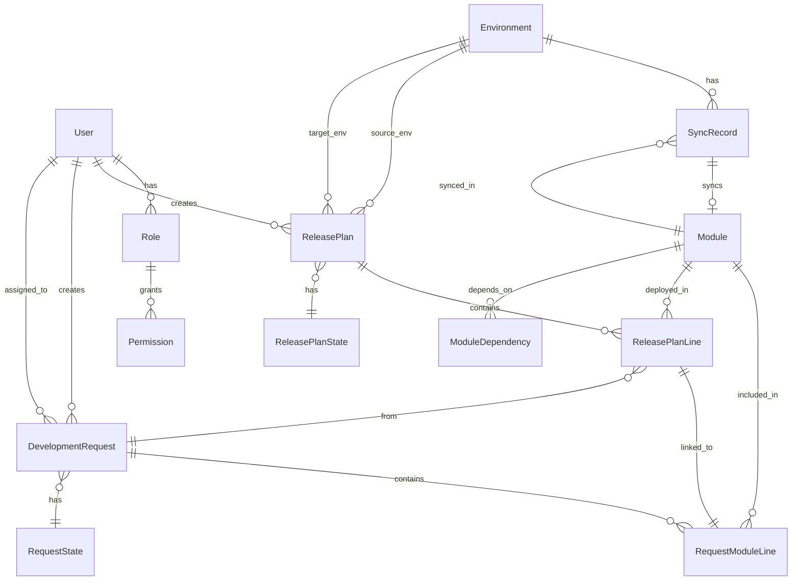

# GPS Odoo Tracker - Architecture Documentation

## Overview

GPS Odoo Tracker is a full-stack application for managing Odoo 17 module synchronization across multiple environments with RBAC (Role-Based Access Control). It provides a secure, queryable release management engine for tracking module versions, drift detection, and release planning.

**Stack**: React + FastAPI + PostgreSQL (monorepo: `backend/` + `frontend/`)

**Total Symbols Indexed**: 3171  
**Relationships**: 12234  
**Execution Flows**: 212

---

## Architecture Diagram

```mermaid
graph TB
    subgraph Frontend["Frontend (React)"]
        UI["UI Components"]
        Pages["Pages<br/>(Dashboard, DR, RP, Env, Modules, Reports)"]
        Hooks["Hooks<br/>(React Query)"]
        Store["Zustand Store"]
        ApiClient["API Client"]
    end

    subgraph Backend["Backend (FastAPI)"]
        subgraph API["API Layer - app/api/v1/"]
            Auth["auth.py<br/>(/auth)"]
            DR["development_requests.py<br/>(/dev-requests)"]
            RP["release_plans.py<br/>(/release-plans)"]
            Env["environments.py<br/>(/environments)"]
            Modules["modules.py<br/>(/modules)"]
            Reports["reports.py<br/>(/reports)"]
            Sync["sync.py<br/>(/sync)"]
            Users["users.py<br/>(/users)"]
            Roles["roles.py<br/>(/roles)"]
            Dashboard["dashboard.py<br/>(/dashboard)"]
        end

        subgraph Services["Services Layer - app/services/"]
            DR_Service["development_request_service.py"]
            RP_Service["release_plan_service.py"]
            Sync_Service["sync_service.py"]
            Auth_Service["auth_service.py"]
            Dashboard_Svc["dashboard_service.py"]
            Comparer["comparer.py<br/>(Version Logic)"]
            OdooClient["odoo_client.py<br/>(XML-RPC)"]
            Encryption["encryption.py"]
        end

        subgraph Repositories["Repository Layer - app/repositories/"]
            DR_Repo["development_request.py"]
            RP_Repo["release_plan.py"]
            Env_Repo["environment.py"]
            Module_Repo["module.py"]
            Audit_Repo["audit_log.py"]
            User_Repo["user.py"]
        end

        subgraph Models["Models Layer - app/models/"]
            Base["base.py<br/>(SQLAlchemy)"]
            DR_Model["development_request.py"]
            RP_Model["release_plan.py"]
            Env_Model["environment.py"]
            Module_Model["module.py"]
            User_Model["user.py"]
            Role_Model["role.py"]
            Sync_Model["sync_record.py"]
            Report_Model["comparison_report.py"]
            ControlParams["control_parameters/<br>(states, rules)"]
        end

        subgraph Core["app/core/"]
            Config["config.py"]
            Security["security_matrix.py<br/>(RBAC Engine)"]
            Database["database.py"]
            Deps["dependencies.py"]
        end
    end

    subgraph External["External Systems"]
        Odoo["Odoo 17<br/>(XML-RPC)"]
        Postgres[("PostgreSQL")]
    end

    %% Frontend connections
    Pages --> Hooks
    Hooks --> ApiClient
    ApiClient --> Auth
    Store --> ApiClient

    %% API to Services
    Auth --> Auth_Service
    DR --> DR_Service
    RP --> RP_Service
    Sync --> Sync_Service
    Reports --> Dashboard_Svc

    %% Service to Repository
    DR_Service --> DR_Repo
    RP_Service --> RP_Repo
    Sync_Service --> Sync_Service
    Sync_Service --> OdooClient

    %% Repository to Models
    DR_Repo --> DR_Model
    RP_Repo --> RP_Model
    Env_Repo --> Env_Model
    Module_Repo --> Module_Model

    %% Models to Database
    Base --> Postgres
    DR_Model --> Base
    RP_Model --> Base
    Env_Model --> Base
    Module_Model --> Base
    User_Model --> Base

    %% Services to Models
    RP_Service --> Comparer
    Sync_Service --> OdooClient

    %% Core
    Auth_Service --> Security
    DR_Service --> Security
    RP_Service --> Security
    Auth_Service --> Config
    All --> Database
```



---

## Functional Areas

### 1. API Layer (`app/api/v1/`)

| Endpoint File | Route Prefix | Purpose |
|---------------|--------------|---------|
| `auth.py` | `/auth` | JWT authentication, token refresh |
| `development_requests.py` | `/dev-requests` | DR CRUD, state transitions, line management |
| `release_plans.py` | `/release-plans` | Release plan lifecycle, line management |
| `environments.py` | `/environments` | Environment configuration, module lists |
| `modules.py` | `/modules` | Module master data, dependencies |
| `reports.py` | `/reports` | Drift reports, comparison reports |
| `sync.py` | `/sync` | Trigger sync, track sync records |
| `users.py` | `/users` | User management |
| `roles.py` | `/roles` | Role definitions |
| `dashboard.py` | `/dashboard` | Aggregated dashboard data |
| `saved_views.py` | `/saved-views` | User-specific view configurations |

### 2. Services Layer (`app/services/`)

| Service | Responsibility |
|---------|---------------|
| `release_plan_service.py` | Core release plan logic: CRUD, line linking, state transitions, pre-flight validation gates |
| `development_request_service.py` | DR lifecycle, state machine, line management |
| `sync_service.py` | Odoo sync orchestration, progress tracking |
| `comparer.py` | Semantic version parsing, drift action calculation |
| `odoo_client.py` | XML-RPC client for Odoo API calls |
| `auth_service.py` | JWT token management, refresh logic |
| `dashboard_service.py` | Aggregated metrics for dashboard |
| `audit_log_service.py` | Audit trail logging |
| `encryption.py` | Credential encryption/decryption |

### 3. Models Layer (`app/models/`)

**Core Entities**:
- `User` - Authenticated users with roles
- `Role` - Permission definitions
- `Environment` - Odoo environments (Dev, Staging, Prod)
- `Module` - Module master data
- `ModuleDependency` - Module dependency graph

**Business Entities**:
- `DevelopmentRequest` - Development request header
- `RequestModuleLine` - Module lines within a DR
- `ReleasePlan` - Release plan header
- `ReleasePlanLine` - Module lines in a release plan
- `SyncRecord` - Sync execution records
- `ComparisonReport` - Drift comparison reports

**Control Parameters** (`control_parameters/`):
- `RequestState` - DR states (Draft, In Progress, Ready, Done, Cancelled)
- `ReleasePlanState` - Plan states with macro categories
- `ControlParameterRule` - Dynamic configuration rules

### 4. Repository Layer (`app/repositories/`)

Provides data access abstraction with deduplication patterns:

```python
from sqlalchemy.dialects.postgresql import insert
stmt = insert(Module).values(name=name)
stmt = stmt.on_conflict_do_nothing(index_elements=['name'])
```

### 5. Core Layer (`app/core/`)

| Component | Purpose |
|-----------|---------|
| `security_matrix.py` | ABAC engine - Permission checking, RBAC helpers |
| `config.py` | Environment configuration via pydantic-settings |
| `database.py` | SQLAlchemy session management |
| `dependencies.py` | FastAPI dependency injection |

---

## Key Execution Flows

### Flow 1: Create Release Plan → Version Comparison (8 steps)

```
create_release_plan() 
  → _get_env_or_404(source) 
  → _get_env_or_404(target) 
  → _check_skip_level_warning()
  → state_repo.get_draft_state() 
  → repo.create_with_number()
  → repo.get_with_relations()
  → _parse_version()  [for version comparison]
```

**Purpose**: Creates a release plan with environment validation and skip-level warnings.

### Flow 2: Get Eligible Modules for Release Plan (6 steps)

```
get_eligible_modules()
  → _get_plan_or_404()
  → _get_latest_sync_version(source_env)
  → _get_latest_sync_version(target_env)
  → calculate_drift_action()
  → _is_module_version_in_active_plan()
  → _normalize_tuple()  [version normalization]
```

**Purpose**: Wizard flow to identify which DR module lines are eligible for inclusion based on:
1. DR state = "In Progress"
2. UAT gate (Production targets require UAT="Closed")
3. Live drift action ≠ "No Action"
4. Not already in another active plan

### Flow 3: Release Plan State Transition with Pre-flight Validation (6 steps)

```
update_release_plan() [state_id change]
  → _validate_transition_to_inprogress_or_closed()
    → _get_latest_sync_version() [for each line]
    → _parse_version() [compare versions]
    → calculate_drift_action()
    → UAT status check [production only]
```

**Purpose**: Validates gates before moving to "Executing" or "Closed":
- Anti-regression block (target > source = error)
- Uninstalled source block (Production targets)
- UAT closure gate (Production targets)

### Flow 4: Sync Odoo Modules (Cross-boundary flow)

```
sync_service.trigger_sync()
  → odoo_client.authenticate()
  → odoo_client.execute_kw()  [XML-RPC]
  → sync_repository.create()
  → sync_service.update_progress()
  → sync_repository.update()
```

### Flow 5: Version Drift Detection (comparer.py core)

```
calculate_drift_action(source_ver, dest_ver, src_env, tgt_env)
  → parse_semver(source)
  → parse_semver(dest)
  → _normalize_tuple() [pad to 4 components]
  → _compare_tuples()
  → return action: "Upgrade" | "No Action" | "Error (Downgrade)"
```

---

## Security Architecture (RBAC)

### Permission Categories

| Category | Permissions |
|----------|-------------|
| **System** | `system:manage` |
| **Environments** | `environments:read`, `sync:trigger` |
| **Modules** | `modules_master:read` |
| **Dev Requests** | `dev_request:read`, `dev_request:create`, `dev_request:update`, `dev_request:state_change`, `dev_request:reopen`, `dev_request:archive` |
| **Dev Request Lines** | `dev_request_line:create`, `dev_request_line:update`, `dev_request_line:delete` |
| **UAT** | `uat:update` |
| **Release Plans** | `release_plan:read`, `release_plan:create`, `release_plan:update`, `release_plan:delete`, `release_plan:approve` |
| **Artifacts** | `comments:create`, `attachments:create`, `attachments:delete` |
| **Reports** | `reports:read`, `reports:generate`, `reports:export` |

### Role Hierarchy

| Role | Priority | Permissions Summary |
|------|----------|---------------------|
| Admin | 1 | All permissions |
| Manager | 2 | CRUD on DRs, RPs; read all |
| Developer | 3 | Create DRs; edit own DRs; manage lines |
| Viewer | 4 | Read-only access |

### State-Aware Enforcement

```python
# Example: Line management restricted by macro state
if macro != MACRO_DRAFT:
    raise HTTPException("Lines can only be modified in Draft state")

# Example: Closed plans are immutable
if macro in [MACRO_CLOSED, MACRO_FAILED]:
    if not has_permission(user, Permission.SYSTEM_MANAGE):
        raise HTTPException("Only admins can modify closed plans")
```

---

## Data Model Relationships



---

## Environment Ordering

Environments follow a hierarchical order for deployment flow:

| Order | Category | Example |
|-------|----------|---------|
| 4 | Development | DEV |
| 3 | Test | STAGING |
| 2 | QA/UAT | UAT |
| 1 | Production | PROD |

**Deployment Rule**: Source order > Target order (higher to lower)

---

## Key Technologies

| Layer | Technology |
|-------|------------|
| Frontend | React 18, TypeScript, React Query, Zustand, TailwindCSS |
| Backend | FastAPI, SQLAlchemy 2.0, Alembic, Pydantic v2 |
| Database | PostgreSQL |
| Auth | JWT (python-jose), Passlib |
| External API | XML-RPC (Odoo) |
| Rate Limiting | SlowAPI |
